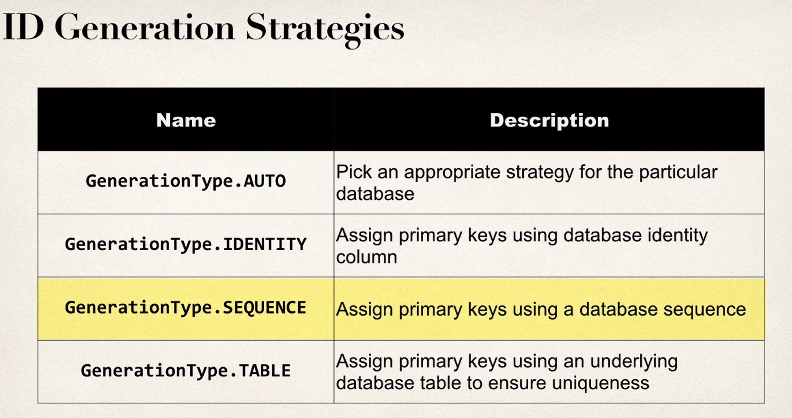

#Hibernate Course

##Configuration

1. Add Hibernate Maven dependencies;
2. Create `hibernate.cfg.xml`:
    ```xml
    <hibernate-configuration>
        <session-factory>
            <!-- JDBC Database connection settings -->
            <property name="connection.driver_class">com.mysql.cj.jdbc.Driver</property>
            <property name="connection.url">jdbc:mysql://localhost:3306/derby_test?useSSL=false&amp;serverTimezone=UTC</property>
            <property name="connection.username">chad</property>
            ...
   ```
   
3. Craete Entity Class - a class that represents a DB table.
   Entity class is a POJO + @Entity
    ```java
    @Entity
    @Table(name = "events")
    public class Event {
   
        // need public constructor:
       public Event() {

       }
   
        @Id                         // private key
        @GeneratedValue(strategy = GenerationType.IDENTITY)
        @Column(name = "id")        // tells hibernate how to name db column
        private int id;             
    
        @Column(name = "event_name")
        private String eventName;
   ...
   }
    ```
4. Use `SessionFactory`/`Session` to interact with DB. 
    - `SessionFactory` - heavy-weight, lives all the run time asked by `Session`s;
    - `Session` - short-lived, an instance from `SessionFactory` each time when db interaction is required;
   
   ```java
      SessionFactory sf = new Configuration()
                     .configure("hibernate.cfg.xml") // 'hibernate.cfg.xml' will be looked in cp by default 
                     .addAnnotatedClass(Event.class)
                     .buildSessionFactory();
      Session session = sf.getCurrentSession();

      try {
         Event testEventObj = new Event("pohod", "bakhch", 50);
         session.beginTransaction();
         session.save(testEventObj);
         session.getTransaction().commit();
      
      } finally {
         sf.close();
      }
    ```
## Java9+ missing classes, eg:
    ```xml
       <dependency>
         <groupId>javax.xml.bind</groupId>
         <artifactId>jaxb-api</artifactId>
         <version>2.3.1</version>
       </dependency>
   
       <dependency>
         <groupId>com.sun.xml.bind</groupId>
         <artifactId>jaxb-impl</artifactId>
         <version>2.3.4</version>
       </dependency>
   
   
   
       <dependency>
         <groupId>com.sun.xml.bind</groupId>
         <artifactId>jaxb-impl</artifactId>
         <version>2.3.3</version>
       </dependency>
   
       <dependency>
         <groupId>com.sun.activation</groupId>
         <artifactId>javax.activation</artifactId>
         <version>1.2.0</version>
       </dependency>
    ```

## Drop Table if exists
To force Hibernate to create tables from @Entity classes, in `hibernate.cfg.xml`:
1. Add `<property name="hibernate.hbm2ddl.auto">create</property>`
2. Use precise SQL dialect, e.g `<property name="dialect">org.hibernate.dialect.MySQL8Dialect</property>`

##CRUD

Generic approach:
1. new `SessionFactory` in try
2. Create `Session`
3. Instantiate @Entity object
4. session.beginTransaction()
5. session.save() or whatever operation
6. session.getTransaction().commit()
7. close `SessionFactory` in finally

### Primary Key Generation Strategies

To make a field AUTO INCREMENT:
```java
    @Id
    @GeneratedValue(strategy = GenerationType.IDENTITY)
    @Column(name = "id")
    private int id;
```
Other strategies:


You can create a **CUSTOM** generation strategy. For this: 

1. Implement `org.hibernate.id.IdetifierGenerator`
2. Override `public Serializable generate(...)`

### CRUD:Query

make use of HQL:

```java
List<Event> eventList = session
                    .createQuery("from Event s where s.id = 1")
                    .getResultList();
```
OR
```java
    session
           .createQuery("from Event s where s.id = x OR s.id = y")
           .getResultList();
```

### CRUD:Update

```java
    Event mEvent = session.get(Event.class, id);
    mEvent.setLocation("foo")
     session.getTransaction().commit(); // here persistence occurs
```

## Hibernate mappings

### @OneToOne
```java
@Entity
@Table(name= "users")
public class User {
   // Unidirectional User -> UserDetail
   // CascadeType.All - means that any action on the `users` table will propagate to `user_details`
   @OneToOne(cascade = CascadeType.ALL)
   // this defines the foreign key in `users`. this will map to the primary key of `userDetail`
   @JoinColumn(name = "detail_id")
   private UserDetail userDetail;
   
   // ...
}
``` 

To make the relationship bidirectional, in `UserDetail` class:
```java
    @OneToOne(mappedBy = "userDetail")
    private User user;
```
- where `userDetail` is the `UserDetail` field name in [User](src/main/java/xany/models/User.java) class.


### @OneToMany

See implementation in [User.java](src/main/java/xany/models/User.java), field `private List<Comment> comments`.

Eager vs Lazy loading, the defaults are [here](https://stackoverflow.com/questions/26601032/default-fetch-type-for-one-to-one-many-to-one-and-one-to-many-in-hibernate).

### No Session exception

With Lazy loading, u get an Exception when fetching data after session close:

```java
   ...
   User usr = session.get(User.class, userId);
   session.close();
   usr.getComments() // <- this fails
   ...
```

- Workaround 1: call getter `getComments()` while session is open:
   ```java
      ...
      User usr = session.get(User.class, userId);
      usr.getComments() // just call this
      session.close();
      usr.getComments() // <- now this works fine
      ...
   ```
- Workaround 2: query with HQL:
   ```java
   Query<User> quey = session.createQuery("select i from Users i JOIN FETCH i.comments where i.id=:userId");
   query.setParameter("userId", x);
   User usr = query.getSingleResult();
```


